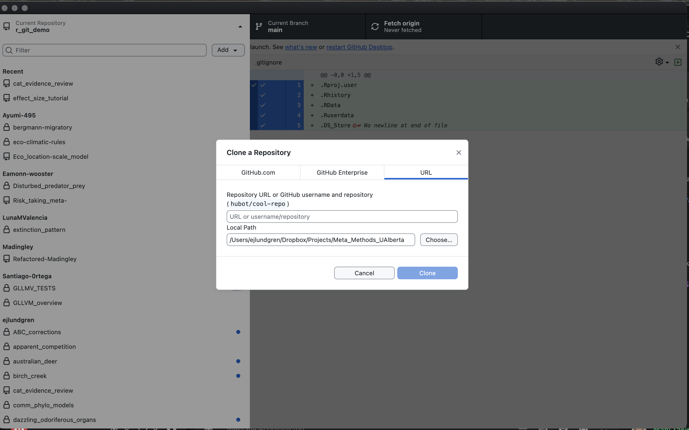
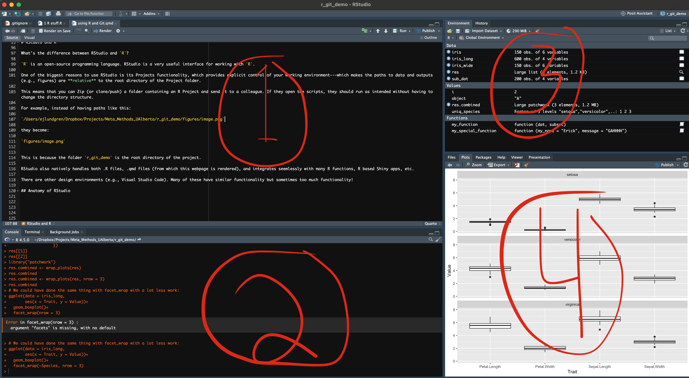
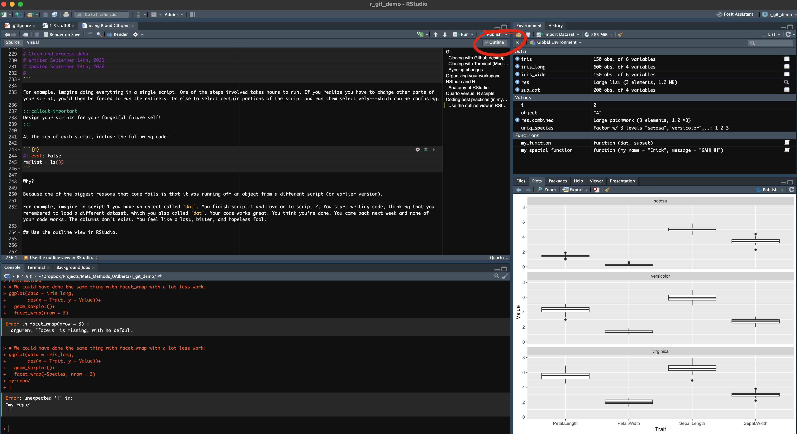

I started this 1 hour before coding club...Let's see what happens.

# Git
This lab---and most modern labs---base their workflows on Github.

Make sure you have a Github account. 

Github works by mirroring the contents of a directory (what we call a 'repo') on your own computer.

Changes on one end can be synced *intentionally* between the remote and your own computer.

We start by **cloning** repos. This allows you to copy the entirey of a project folder onto your own machine, where you can then make changes.

Clone this repo by going [here](https://github.com/ejlundgren/r_git_demo).

To clone, copy the URL (the URL that ends in .git). To see the URL you have to push the green "Code" button.

### Cloning with Github desktop

With Github Desktop [(download here)](https://desktop.github.com/download/) you can click the top bar and go Add -> Clone repository -> URL and then paste the URL into the field.

In the "Local Path" field, you can specify where on your computer to clone the folder.



### Cloning with Terminal (Mac, Linux)
I don't know how to do this on Windows and I don't want to learn.

In Mac or Linux you can do this in the Terminal.

First, navigate to the location where you want the repo to be cloned:

```bash
# cd means "change directory"
cd ~/Documents/Projects/

```

Then:

```bash

git clone https://github.com/ejlundgren/r_git_demo.git
```

After this, the folder structure should show up on your computer in the designated location.

:::callout-note
In Git, "remote" stands for the remote copy of the project that is hosted on Github.

"local" stands for the copy on your own hard drive. We make changes to the copies on our computers and then **push** these changes to the remote. Do not try to make changes to the copies on the remote (e.g., on github.com)
:::

One important reason to use Github is the **Issues** page. This allows you to keep track of a project's history in a self-contained environment specific to that project (instead of your nightmare of a google inbox or text thread on Discord). Issues can be tagged as **Open** or **Closed** and can be sorted based on custom categories (e.g., "modeling", "conceptual").

Feel free to file an Issue for this demo repo: https://github.com/ejlundgren/r_git_demo/issues

## Syncing changes

Github does not automatically sync changes between your computer and the remote.

Instead, you have to manage this. This can be quite complex---as github was designed for use by large teams.

In science, we rarely need to be as complex. At its simplest, this is how we use Git in COSSEE:

1. You toil and toil and finally finish a step: you've fit your models! However, there are some models that are weird and you think there might be some errors.

2. You make a **commit** and title it "model fitting stage 1 complete".

> This saves all of your changes in your repo under this commit name. 

3. You "push" the commit to the remote.

> This updates the **remote** with the changes you've made locally

4. You describe the problems you were having in the **Github Issues** page. Since your repo is private, only you and collaborators you have invited to the project have access to this page. 

5. You message Shinichi and say, "hey Shinichi, I pushed the model script and I made a detailed Issue in the Issues page"

6. Shinichi says, "great! I'll take a look over the next week"

7. At 3am the next morning, Shinichi finishes looking at your scripts, makes some changes of his own. He then **commits** those changes and **pushes** them to the remote.

8. At 7am, you panic seeing Shinichi's messages. You fight off your hangover and **pull** his changes down to review them.

9. Shinichi found an error in your original code and you fix it. Everything works like butter and you're happy as a clam.

Just like that!

When working with more people, things get more complex. That's when things like **branches** become important. However, we rarely need these in ecology and evolution, unless working in very large collaborative groups. This degree of complexity needs careful thought because it can easily go wrong.

# Organizing your workspace
One of the most annoying things is to come back to a project after 8 months in review and to be utterly confused by your own scripts. You labored and labored and labored and you thought you left everything nice and clean but instead your scripts look like this:

**"final_analysis_v2.R", "final_final_analysis_v2.R", "master_final_analysis_v2.R".**

And somehow, they all have the same modification date.

You open those scripts up to figure out which one is up to date. They all opened different versions of your dataset, with names like:

**"master_data_final.csv", "final_master_data.csv", "final_final_master_data.csv".** 

That's why data and script hygiene are so important for your mental health.

I organize my projects like this:

::: {.callout-note appearance="simple"}
```text
my-repo/
|
├── my-repo.RProj             # The .RProj file. See below
|
├── scripts/                  # Scripts
│   ├── 0_data_cleaning       # Script subdirectories, numbered in order of operation
|   |    └── 0_load_and_clean_data.R
|   |    └── 1_check_dependencies.R
|   ├── 1_analysis
|   |    └── 0_fit_models.R
|   |    └── 1_plot_models.R
|
├── data/                       # Raw data file. These are sacred and rarely manipulated
│   └── raw_dataset.csv
│
├── builds/                     # Processed data. These are rapid outputs made by your scripts
│   └── 0_processed_dataset.csv
│   └── 1_dependencies.csv
|
├── figures/                    # Visual outputs
│   └── figure_1.png
|
├── pages/                      # website qmd files
│   └── analysis-tutorial.qmd
|
├── docs/                       # website html files which can be rendered to this location automatically
│   └── analysis-tutorial.html  # Specify in .yml (see the one for this repo) for the rendered html to go here.
|   └── index.html
|
├── index.qmd                   # Website tutorial index, which must live in root directory
|
├── _quarto.yml                 # The website yaml file that controls webpage formatting and structure
```
:::

Note that the scripts are organized into numbered subfolders (e.g., 0_data_cleaning and 1_analysis). Within each of these folders are .R scripts that **do** things that are clearly within the scope of their name. Keep .R scripts simple and clean because it's best way to remember what your code does.

The scripts produce `builds` (or figures). `builds` are cleaned datasets derived from the raw data in the sacred `data` directory.

In the example workflow above, the scripts clean and process the raw_dataset (in `data/raw_dataset.csv`) and produce a 0_processed_dataset.csv in the `builds` directory as well as a `1_dependencies.csv` sidecar file.

The next scripts in `scripts/1_analysis/` then fit models and produce the figure in the `figures` directory.

If you are building a website about your Github project, then you can put detailed webpages in a "pages" directory. However, you must put the home page (`index.qmd`) and the yml file (`_quarto.yml`) in the root directory.

## Big data
Git will get locked up if you try to push files over 25MB or 50MB. It's possible to install Git large-file-storage (LFS) but it's never really worked for me.

There are two main work arounds.

One is to fragment your big data into small pieces. Git wont' handle a single 25 MB file but can handle 25 1MB files. This is a bit cumbersome but sometimes the best approach, especially if those data files are your actual coding outputs---e.g., from simulations.

Another option is to have a separate parallel directory for large data. This is shared directly with collaborators via Google Drive or WeTransfer. This is the preferred option if this large data is static and won't be directly modified. For example, species range maps.

In this case, the outputs of your scripts, derived from the large data, should live in your Github repo and are hopefully <25 or 50 MB.

If you're setting up a parallel directory it should look something like this:

::: {.callout-note appearance="simple"}

```text
master_folder/                      # Not a Github repo. This could be called "bird_ecogeographic_rules"
|
├── my-repo/                        # The github repo. This might be called "bergmans_rule". 
|                                   # There might be other parallel repos that use the same big-data as well
|
├── big-data/                       # A directory for big data that is shared via Google Drive with all collaborators
│   
```
:::

Using RStudio, and relative paths (see below), you and collaborators can access files in the `big-data` directory using `../big-data/master_data.csv`. The `..` moves **up** the directory structure. These paths should work on anyone's computer, as long as `big-data` is in the same relative location to the github repo where your scripts live. 

# RStudio and R

What's the difference between RStudio and `R`?

`R` is an open-source programming language. RStudio is a very useful interface for working with `R`. 

One of the biggest reasons to use RStudio is its Projects functionality, which provides explicit control of your working environment---which makes the paths to data and outputs (e.g., figures) are **relative** to the root directory of the Project folder.

This means that you can Zip (or clone/push) a folder containing an R Project and send it to a colleague. If they open the scripts, they should run as intended without having to change the directory structure.

For example, instead of having paths like this:

`/Users/ejlundgren/Dropbox/Projects/Meta_Methods_UAlberta/r_git_demo/figures/image.png`


they become:

`figures/image.png`


This is because the folder `r_git_demo` is the root directory of the project.

RStudio also natively handles both .R files, .qmd files (from which this webpage is rendered), and integrates seemlessly with many R functions, R based Shiny apps, etc.

There are other design environments (e.g., Visual Studio Code). Many of these have similar functionality but sometimes too much functionality! 

## Anatomy of RStudio


1. This is the Editor window, where you edit and write code including R code and .qmd code. You can execute this code line by line with keyboard shortcuts. These differ between different operating systems and between .qmd files and .R files. You can also Ctrl-A select all and execute the entire script.

2. .R code is executed here, in the Console. This is where you see the output.

For example, if the code in the script ('1' in the image) was this:

```{r}
#| eval: false
5 * 15
```

The output would show up in the Console ('2' in the image)

:::callout-note
If you prefer working with .qmd files instead of .R files, you can specify to have the output displayed directly in the primary editor window. I don't like this because it takes up a lot of space. But some people love it. They can add how to do that here, if they want.
:::

3. The environment / history / Git pane. The Environment panel lists the objects loaded in the environment. This pane also sometimes includes a native Git client (like Github Desktop) and a History panel, which shows file changes. I've never once used it.

4. This has a few different functions. Files allows you to see the contents of directories. Plots is where figures print. Help is where package documentation shows up. Viewer shows interactive plots. I've never used "Presentation". 

# Quarto versus .R scripts
The website you're seeing right now was written in Quarto. Quarto is a markdown based language that can render to PDF or html and includes both text (like this sentence) as well as executed code (like the block of R code above).

You can create Quarto scripts in RStudio by going to File -> New File -> Quarto Document.

Ctrl+N (or Command+N) creates a .R file by default.

Some people write **everything** in Quarto scripts. I do not. My personal workflow is as follows:

1. Write entire project in .R scripts.

2. Double check that they all run and produce the same results consistently. You can do this with the `source` function in a separate script as well.

`source` executes the code input to it:

```{r}
#| eval: false
source("scripts/0_load_and_clean_data.R")
source("scripts/0_clean_data.R")
```

3. I then make a website, which is a great supplementary resource to go alongside your paper. For the website, I copy and paste the simplest version of the code from the .R files to .qmd files. I leave out most of the checks and tests that I do in a regular R script.

One of the reasons I work this way is because I fill my .R scripts with millions of extra checks and tests. E.g., checking that the number of rows is as expected, that no factor levels have gone missing, etc. I also frequently, many many times in a session, select all the code above my current line and rerun to make sure that the code works as anticipated (and always include a `rm(list = ls())` call at the top of my script.)

With that, let's talk about coding best practices:

# Coding best practices (in my opinion)

Start every project with a comment specifying what the script is for. Scripts should be for short, modular operations, like loading and cleaning data, creating a table of models to run, calculating effect sizes, or fitting models. Doing too much in a script can make bulky chokepoints.

```{r}
#
# Clean and process data
# Written September 14th, 2025
# Updated September 14th, 2026
#
```

For example, imagine doing everything in a single script. One of the steps involved takes hours to run. If you realize you have to change other parts of your script, you'd then be forced to run the entirety. Or else to select certain portions of the script and run them selectively---which can be confusing.

:::callout-important
Design your scripts for your forgetful future self! 
:::

At the top of each script, include the following code:

```{r}
#| eval: false
rm(list = ls())
```

Why?

Because one of the biggest reasons that code fails is that it was running off an object from a different script (or earlier version).

For example, imagine in script 1 you have an object called `dat`. You finish script 1 and move on to script 2. You start writing code, thinking that you loaded a different dataset, which you also called `dat`. Your code works great. You think you're done. You come back next week and none of your code works. The columns don't exist. You feel like a lost, bitter, and hopeless fool.

All of this was because of a dirty environment. Keep your scripts tidy, with a simple focus, and clean the environment between each one :) 

This also helps you break complex steps into modular, easier to understand steps.

## Use the outline view in RStudio.



See that red circle? Click that puppy. It'll show you an outline.

In a .R script, you can create outline headers with:

```{r}
# This is an outline header ---------------------------------------

# >>> I use these to create subheadings --------------------------
```

In a qmd, you can use "#" to create headings and subheadings, which are section titles.

A full script might look like this then:

```{r}
#| eval: false
#
#
# Clean and process data
# Written July 14th, 2025
# Updated September 14th, 2026
#
#
# Clean environment -------------------------------------------------------
rm(list = ls())

# Load libraries ----------------------------------------------------------
library("dplyr")

# Load data ---------------------------------------------------------------
dat <- read.csv("data/master_dat.csv")

# Or if loading "big data":
dat <- read.csv("../big-data/master_dataset.csv")
```

# Explore
Please clone this repo by navigating to https://github.com/ejlundgren/cossee-coding-club and following the steps above.

Then run the `Sept 14 R stuff.R` script I put in the `scripts` directory. Run the script line-by-line and try to understand what each line is doing. 

Running scripts line by line can be done with Command or Ctrl + Enter. 


